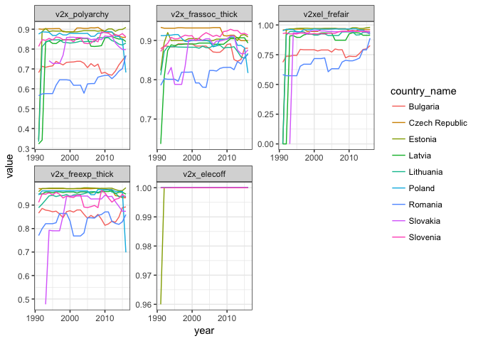
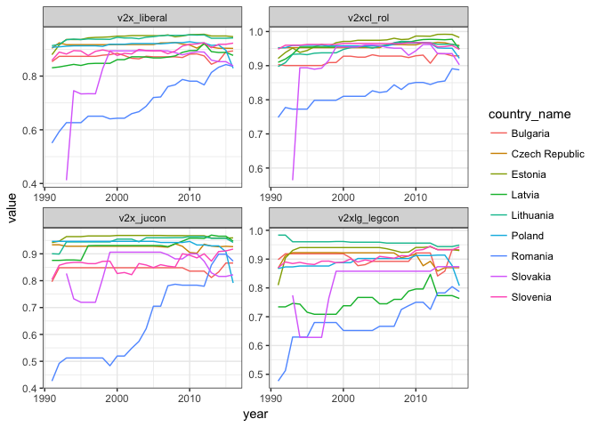
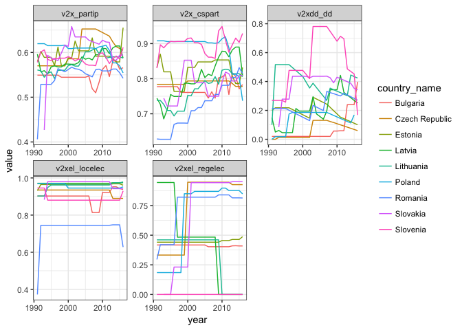
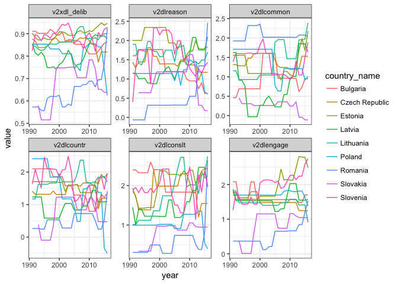
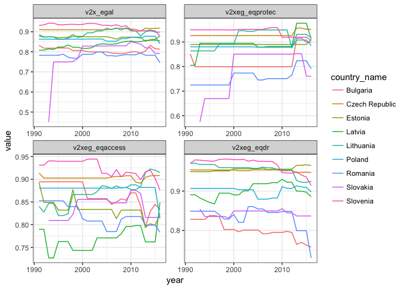

# Patterns of Democracy: models
Vello Pettai, Märten Veskimäe


## Results

The aim of this analysis was to measure (1) the **internal consistency** of the macro-level indices, and (2) the **region-specific consistency** of their subcomponents. Internal consistency measures how well do the subcomponents capture the underlying concept related to the indices. If the subcomponents display a significant amount of covariation, they will force the index to fluctuate with it. If, however, they display little covariation, their fluctuations cancel each other out and the index maintains its previous level. Region-specific consistency measures a similar phenomenon, only this time on a subcomponent level across individual countries. It can be interpreted as a measure of covariance between country cases. Larger effect sizes indicate higher covariance between individual countries and vice versa.

For each macro-level index a model was specified consisting of its subcomponents and its lagged term. Including the lagged term permits to distinguish between the internal consistency and the region-specific consistency in a single model. Including the lagged term is also justified due to the cross-sectional values being partially determined by their previous periods. In other words, phenomena captured in these indices often unfolds over several periods which should be accounted in the statistical models.

The models were specified as follows:

$y_{it} = X_{it}\beta + a_i + \rho y_{it-1} + u_{it}$ for $t = 1,...,T$ and $i = 1,...,N$

where:

- $y_{it}$ is the index value for country $i$ at time $t$
- $X_{it}\beta$ is the subcomponent $X_{it}$ multiplied by the effect size $\beta$
- $a_i$ is the unobserved time-invariant country effect 
- $\rho y_{it-1}$ is the lagged index value $y_{it-1}$ multiplied by the effect size $\rho$
- $u_{it}$ is the error term

Pooled OLS (POLS), fixed effects (FE) and SYSTEM GMM (GMM-SYS) models were used to analyze the data. Including the lagged dependent variable as a regressor violated the strict exogeneity assumption ($E(\epsilon_{it}|\alpha_i,x_{i1},...,x_{iT})\neq0$) in case of POLS and FE. Therefore, both the individual-specific effect ($\alpha_i$) and the subcomponent effects ($\beta$) became inconsistent. To overcome this problem, dynamic panel GMM (*generalized method of moments*) framework is often used, which is consistent if T is small and fixed, and N >> T. In this specific case, the latter condition does not hold as N is limited by the number of countries included in the analysis, roughly equal to $\frac{T}{2}$. Therefore, POLS and FE models were a more appropriate choice, although both estimates were biased. Despite that, both models permit to analyze the proportional relationships between the lagged dependent variables (index consistency) and the individual subcomponents (region-specific consistency).

When interpreting the results, POLS estimates were biased upwards, while FE estimates were biased downwards from the true parameters. For comparison, GMM-SYS estimates were included in the analysis, which should lie in between POLS and FE results. GMM-SYS estimates are, however, unstable in the current setting.

### Index Consistency

| Lagged term              | Pooled OLS              | Fixed effects         | SYSTEM GMM            |
|:-------------------------|:-----------------------:|:---------------------:|----------------------:|
| Electoral democracy      |  0.053*   <br> (0.023)  | 0.021    <br> (0.023) | 0.040    <br> (0.043) |
| Liberal component        |  -0.018   <br> (0.010)  | -0.017   <br> (0.009) | 0.014    <br> (0.033) |
| Participatory component  |  0.547*** <br> (0.049)  | 0.363*** <br> (0.047) | 0.732*** <br> (0.095) |
| Deliberative component   |  0.276*** <br> (0.029)  | 0.224*** <br> (0.031) | 0.929*** <br> (0.025) |
| Egalitarian component    |  0.024    <br> (0.013)  | 0.020    <br> (0.012) | 0.065**  <br> (0.024) |
| Note: \*p<0.05; \*\*p<0.01; \*\*\*p<0.001         ||                       |                       |

Table: Lagged terms of macro-level indices

The results for index consistency are presented in the above table. The analyzed indices can be grouped into high consistency and low consistency indices. The indices with low consistency were participatory component and deliberative component indices, which maintained their level in spite of fluctuations in their subcomponents (indicated by the high lagged term coefficient). The indices with high internal consistency were electoral democracy, liberal component and egalitarian component indices (indicated by the low lagged term coefficient).

**Sellest peaks midagi järeldama siin**

### Region-specific Consistency

| Subcomponents                                     | Pooled OLS                    | Fixed effects                 | SYSTEM GMM                    |
|:--------------------------------------------------|:-----------------------------:|:-----------------------------:|:-----------------------------:|
| Freedom of association                            | 0.407*** <br> (0.362, 0.453)  | 0.393*** <br> (0.327, 0.459)  | 0.413***  <br> (0.275, 0.551) |
| Clean elections                                   | 0.465*** <br> (0.436, 0.494)  | 0.481*** <br> (0.453, 0.510)  | 0.472*** <br> (0.413, 0.532)  |
| Freedom of expression                             | 0.509*** <br> (0.479, 0.540)  | 0.532*** <br> (0.498, 0.565)  | 0.514*** <br> (0.444, 0.584)  |
| Note: \*p<0.05; \*\*p<0.01; \*\*\*p<0.001                                        ||                               |                               |

Table: Subcomponent effect sizes for electoral democracy index

In case of electoral democracy index, the most coherent subcomponent was freedom of expression, followed by clean elections and freedom of association. While the differences between individual subcomponents were not great, significant differences were present in case of freedom of expression and freedom of association. Overall, however, the electoral domcracy index has been consistent in the Eastern-European region on the subcomponent level.

| Subcomponents                                     | Pooled OLS                    | Fixed effects                 | SYSTEM GMM                    |
|:--------------------------------------------------|:-----------------------------:|:-----------------------------:|:-----------------------------:|
| Equality before the law and individual liberties  | 0.325*** <br> (0.300, 0.350)  | 0.344*** <br> (0.300, 0.388)  | 0.307*** <br> (0.279, 0.334)  |
| Judicial constraints on the executive             | 0.349*** <br> (0.337, 0.362)  | 0.345*** <br> (0.331, 0.358)  | 0.342*** <br> (0.315, 0.369)  |
| Legislative constraints on the executive          | 0.337*** <br> (0.326, 0.348)  | 0.323*** <br> (0.304, 0.341)  | 0.324*** <br> (0.302, 0.346)  |
| Note: \*p<0.05; \*\*p<0.01; \*\*\*p<0.001                                        ||                               |                               |

Table: Subcomponent effect sizes for liberal component index

In case of liberal component, all the subcomponents were equally consistent.

| Subcomponents                                     | Pooled OLS                    | Fixed effects                 | SYSTEM GMM                    |
|:--------------------------------------------------|:-----------------------------:|:-----------------------------:|:-----------------------------:|
| Civil society participation                       | 0.081*** <br> (0.040, 0.122)  | 0.187***  <br> (0.132, 0.241) | 0.078* <br> (0.004, 0.152)    |
| Direct popular vote                               | 0.012    <br> (-0.001, 0.025) | 0.001     <br> (-0.019, 0.020)| 0.008   <br> (-0.002, 0.018)  |
| Elected local government power                    | 0.093*** <br> (0.060, 0.127)  | 0.280***  <br> (0.175, 0.385) | 0.095* <br> (0.021, 0.168)    |
| Elected regional government power                 | 0.016*** <br> (0.008, 0.024)  | 0.012**   <br> (0.003, 0.020) | 0.012   <br> (-0.002, 0.026)  |
| Note: \*p<0.05; \*\*p<0.01; \*\*\*p<0.001                                        ||                               |                               |

Table: Subcomponent effect sizes for participatory component index

In case of participatory component, elected local government power and civil society participation were equally consistent, while direct popular vote and elected regional government power were less so (direct popular vote was also statistically insignficant). This indicates that participatory component has been one of the factors differenciating Eastern-European young democracies, manily due to differenct patterns in direct popular vote and elected regional government power.

| Subcomponents                                     | Pooled OLS                    | Fixed effects                 | SYSTEM GMM                    |
|:--------------------------------------------------|:-----------------------------:|:-----------------------------:|:-----------------------------:|
| Reasoned justification                            | 0.030*** <br> (0.024, 0.035)  | 0.037***  <br> (0.031, 0.043) | 0.017* <br> (0.003, 0.031)    |
| Common good justification                         | 0.009*** <br> (0.005, 0.012)  | 0.007*    <br> (0.001, 0.013) | 0.011   <br> (-0.008, 0.029)  |
| Respect for counterarguments                      | 0.036*** <br> (0.030, 0.042)  | 0.037***  <br> (0.031, 0.043) | 0.007   <br> (-0.011, 0.025)  |
| Range of consultation                             | 0.035*** <br> (0.030, 0.041)  | 0.034***  <br> (0.028, 0.040) | 0.007   <br> (-0.005, 0.020)  |
| Engaged society                                   | 0.045*** <br> (0.038, 0.052)  | 0.054***  <br> (0.046, 0.061) | 0.001   <br> (-0.012, 0.015)  |
| Note: \*p<0.05; \*\*p<0.01; \*\*\*p<0.001                                        ||                               |                               |

Table: Subcomponent effect sizes for Deliberative component index

In case of deliberative component engaged society, respect for counterarguments, range of consultation, respect for counterarguments, and reasoned justification were almost equally consistent (only significant difference was found between respect for counterarguments and reasoned justification). Less consistent was the common good justification subcomponent.

| Subcomponents                                     | Pooled OLS                    | Fixed effects                 | SYSTEM GMM                    |
|:--------------------------------------------------|:-----------------------------:|:-----------------------------:|:-----------------------------:|
| Equal protection index                            | 0.333*** <br> (0.316, 0.349)  | 0.345***  <br> (0.326, 0.364) | 0.315*** <br> (0.288, 0.341)  |
| Equal access index                                | 0.326*** <br> (0.310, 0.342)  | 0.304***  <br> (0.276, 0.332) | 0.294*** <br> (0.272, 0.316)  |
| Equal distribution of resources                   | 0.326*** <br> (0.310, 0.342)  | 0.352***  <br> (0.316, 0.388) | 0.304*** <br> (0.285, 0.324)  |
| Note: \*p<0.05; \*\*p<0.01; \*\*\*p<0.001                                        ||                               |                               |

Table: Subcomponent effect sizes for Egalitarian component index

In case of egalitarian component, all the subcomponents were equally consistent.

## Models

### Model specification

- v2x_liberal ~ lag(v2x_liberal,1) + v2xcl_rol + v2x_jucon + v2xlg_legcon
- v2x_polyarchy ~ lag(v2x_polyarchy,1) + v2x_frassoc_thick + v2xel_frefair + v2x_freexp_thick + v2x_elecoff + v2x_suffr
- v2x_partip ~ lag(v2x_partip,1) + v2x_cspart + v2xdd_dd + v2xel_locelec + v2xel_regelec
- v2xdl_delib ~ lag(v2xdl_delib,1) + v2dlreason + v2dlcommon + v2dlcountr + v2dlconslt + v2dlengage
- v2x_egal ~ lag(v2x_egal,1) + v2xeg_eqprotec + v2xeg_eqaccess + v2xeg_eqdr

### Variable names

**v2x_polyarchy**: electoral democracy index

- v2x_frassoc_thick: freedom of association
- v2xel_frefair: clean elections
- v2x_freexp_thick: freedom of expression
- v2x_elecoff: elected officials
- v2x_suffr: suffrage

**v2x_liberal**: liberal component index

- v2xcl_rol: equality before the law and individual liberties
- v2x_jucon: judicial constraints on the executive
- v2xlg_legcon: legislative constraints on the executive

**v2x_partip**: participatory component index

- v2x_cspart: civil society participation
- v2xdd_dd: direct popular vote
- v2xel_locelec: elected local government power
- v2xel_regelec: elected regional government power

**v2xdl_delib**: deliberative component index

- v2dlreason: reasoned justification
- v2dlcommon: common good justification
- v2dlcountr: respect for counterarguments
- v2dlconslt: range of consultation
- v2dlengage: engaged society

**v2x_egal**: egalitarian component index

- v2xeg_eqprotec: equal protection index
- v2xeg_eqaccess: equal access index
- v2xeg_eqdr: equal distribution of resources

## General settings

Filters:

- Countries: Estonia, Latvia, Lithuania, Poland, Czech Republic, Slovakia, Slovenia, Bulgaria, Romania
- Years: 1991-...

No other pre-processing was applied.

### R setup


```r
library(tidyverse)
library(reshape2)
library(plm)
vdem_data = function(loc = "vdem71.csv",
                     countries = c("Estonia","Latvia","Lithuania","Poland","Czech Republic",
                                   "Slovakia","Slovenia","Bulgaria","Romania"),
                     cols = NULL,
                     y = 1991:format(Sys.time(),"%Y"),
                     std = F,
                     input = F,
                     dif = F,
                     smooth = F)
{
  d = data.table::fread(loc,verbose=F) %>%
    filter(country_name %in% countries,
           as.numeric(year) %in% y) %>%
    .[c("country_name", "year", cols)]
  s = function(x)smooth(x)
  di = function(x) c(0,tail(x,-1) - head(x,-1))
  if(std==T) d[cols] = scale(d[cols])
  if(input==T) d = fill(d,cols)
  if(smooth==T) d[cols] = by(d[cols],d[1],function(x)apply(x,2,s)) %>% do.call(rbind.data.frame,.)
  if(dif==T) d[cols] = by(d[cols],d[1],function(x)apply(x,2,di)) %>% do.call(rbind.data.frame,.)
  return(d)
}

model_vars = list(
  v2x_liberal = c("v2x_liberal","v2xcl_rol", "v2x_jucon", "v2xlg_legcon"),
  v2x_polyarchy = c("v2x_polyarchy", "v2x_frassoc_thick", "v2xel_frefair", "v2x_freexp_thick", "v2x_elecoff", "v2x_suffr"),
  v2x_partip = c("v2x_partip","v2x_cspart", "v2xdd_dd", "v2xel_locelec", "v2xel_regelec"),
  v2xdl_delib = c("v2xdl_delib","v2dlreason", "v2dlcommon", "v2dlcountr", "v2dlconslt", "v2dlengage"),
  v2x_egal = c("v2x_egal","v2xeg_eqprotec", "v2xeg_eqaccess", "v2xeg_eqdr"))

analysis = function(vars){
  vdem = vdem_data(cols=vars)
  panel.data = pdata.frame(
    vdem, index=c("country_name","year"),
    drop.index=T, row.names=T,drop.const.series=T) %>% 
    make.pbalanced(balance.type="shared.time")
  
  descriptive = vdem[c("country_name","year",names(panel.data))] %>%
    reshape2::melt(c("country_name", "year")) %>%
    ggplot() +
    geom_line(aes(year,value,color=country_name)) +
    facet_wrap(~variable, scales="free") +
    theme_bw()
  
  f = paste0(names(panel.data[1])," ~ ",paste0("lag(",names(panel.data[1]),",1) + "), paste(names(panel.data[c(-1)]),collapse=" + "))
  fsys = paste0(names(panel.data[1])," ~ ",
                paste0("lag(",names(panel.data[1]),",1) + "),
                paste(names(panel.data[c(-1)]),collapse=" + "),
                paste0(" | lag(",names(panel.data[1]),",2:99)"))
  
  pool = plm(formula(f), data=panel.data, model="pooling")
  fe = plm(formula(f), data=panel.data, model="within")
  sys = pgmm(formula(fsys), data=panel.data, effect="individual", transformation="ld")
  s = summary(sys)
  alpha = panel.data[-1] %>% psych::alpha()
  
  tests = list(alpha = alpha$total$std.alpha,
               fTest=pFtest(fe,pool),
               sargan = s$sargan,
               ac1 = s$m1,
               ac2 = s$m2)
  table = stargazer::stargazer(pool,fe,sys,
                               model.names=F,
                               model.numbers=F,
                               dep.var.labels.include=F,
                               column.labels=c("Pooled OLS","Fixed effects","GMM-SYS"),
                               star.cutoffs=c(0.05,0.01,0.001),
                               no.space=T,
                               ci=T,
                               type="html")
  return(list(img = descriptive,
              tests = tests,
              table = table))
}
```

## Tables

### Index I: v2x_polyarchy

Read 56.8% of 17604 rows
Read 17604 rows and 3153 (of 3153) columns from 0.438 GB file in 00:00:06
This series is constant and has been removed: v2x_suffr

<table style="text-align:center"><tr><td colspan="4" style="border-bottom: 1px solid black"></td></tr><tr><td style="text-align:left"></td><td colspan="3"><em>Dependent variable:</em></td></tr>
<tr><td></td><td colspan="3" style="border-bottom: 1px solid black"></td></tr>
<tr><td style="text-align:left"></td><td>Pooled OLS</td><td>Fixed effects</td><td>GMM-SYS</td></tr>
<tr><td colspan="4" style="border-bottom: 1px solid black"></td></tr><tr><td style="text-align:left">lag(v2x_polyarchy, 1)</td><td>0.053<sup>*</sup></td><td>0.021</td><td>0.040</td></tr>
<tr><td style="text-align:left"></td><td>(0.009, 0.097)</td><td>(-0.024, 0.065)</td><td>(-0.044, 0.124)</td></tr>
<tr><td style="text-align:left">v2x_frassoc_thick</td><td>0.407<sup>***</sup></td><td>0.393<sup>***</sup></td><td>0.413<sup>***</sup></td></tr>
<tr><td style="text-align:left"></td><td>(0.362, 0.453)</td><td>(0.327, 0.459)</td><td>(0.275, 0.551)</td></tr>
<tr><td style="text-align:left">v2xel_frefair</td><td>0.465<sup>***</sup></td><td>0.481<sup>***</sup></td><td>0.472<sup>***</sup></td></tr>
<tr><td style="text-align:left"></td><td>(0.436, 0.494)</td><td>(0.453, 0.510)</td><td>(0.413, 0.532)</td></tr>
<tr><td style="text-align:left">v2x_freexp_thick</td><td>0.509<sup>***</sup></td><td>0.532<sup>***</sup></td><td>0.514<sup>***</sup></td></tr>
<tr><td style="text-align:left"></td><td>(0.479, 0.540)</td><td>(0.498, 0.565)</td><td>(0.444, 0.584)</td></tr>
<tr><td style="text-align:left">v2x_elecoff</td><td></td><td></td><td>-0.478<sup>***</sup></td></tr>
<tr><td style="text-align:left"></td><td></td><td></td><td>(-0.570, -0.387)</td></tr>
<tr><td style="text-align:left">Constant</td><td>-0.473<sup>***</sup></td><td></td><td></td></tr>
<tr><td style="text-align:left"></td><td>(-0.503, -0.442)</td><td></td><td></td></tr>
<tr><td colspan="4" style="border-bottom: 1px solid black"></td></tr><tr><td style="text-align:left">Observations</td><td>206</td><td>206</td><td>9</td></tr>
<tr><td style="text-align:left">R<sup>2</sup></td><td>0.995</td><td>0.974</td><td></td></tr>
<tr><td style="text-align:left">Adjusted R<sup>2</sup></td><td>0.995</td><td>0.973</td><td></td></tr>
<tr><td style="text-align:left">F Statistic</td><td>10,987.760<sup>***</sup> (df = 4; 201)</td><td>1,825.339<sup>***</sup> (df = 4; 193)</td><td></td></tr>
<tr><td colspan="4" style="border-bottom: 1px solid black"></td></tr><tr><td style="text-align:left"><em>Note:</em></td><td colspan="3" style="text-align:right"><sup>*</sup>p<0.05; <sup>**</sup>p<0.01; <sup>***</sup>p<0.001</td></tr>
</table>
$alpha
[1] 0.9034044

$fTest

	F test for individual effects

data:  formula(f)
F = 14.834, df1 = 8, df2 = 193, p-value < 2.2e-16
alternative hypothesis: significant effects


$sargan

	Sargan test

data:  formula(fsys)
chisq = 9, df = 278, p-value = 1


$ac1

	Autocorrelation test of degree 1

data:  formula(fsys)
normal = -1.9356, p-value = 0.05292


$ac2

	Autocorrelation test of degree 2

data:  formula(fsys)
normal = -1.4136, p-value = 0.1575

### Index II: v2x_liberal

```r
ii = analysis(model_vars[["v2x_liberal"]])
```


Read 56.8% of 17604 rows
Read 17604 rows and 3153 (of 3153) columns from 0.438 GB file in 00:00:05

<table style="text-align:center"><tr><td colspan="4" style="border-bottom: 1px solid black"></td></tr><tr><td style="text-align:left"></td><td colspan="3"><em>Dependent variable:</em></td></tr>
<tr><td></td><td colspan="3" style="border-bottom: 1px solid black"></td></tr>
<tr><td style="text-align:left"></td><td>Pooled OLS</td><td>Fixed effects</td><td>GMM-SYS</td></tr>
<tr><td colspan="4" style="border-bottom: 1px solid black"></td></tr><tr><td style="text-align:left">lag(v2x_liberal, 1)</td><td>-0.018</td><td>-0.017</td><td>0.014</td></tr>
<tr><td style="text-align:left"></td><td>(-0.037, 0.002)</td><td>(-0.035, 0.002)</td><td>(-0.050, 0.078)</td></tr>
<tr><td style="text-align:left">v2xcl_rol</td><td>0.325<sup>***</sup></td><td>0.344<sup>***</sup></td><td>0.307<sup>***</sup></td></tr>
<tr><td style="text-align:left"></td><td>(0.300, 0.350)</td><td>(0.300, 0.388)</td><td>(0.279, 0.334)</td></tr>
<tr><td style="text-align:left">v2x_jucon</td><td>0.349<sup>***</sup></td><td>0.345<sup>***</sup></td><td>0.342<sup>***</sup></td></tr>
<tr><td style="text-align:left"></td><td>(0.337, 0.362)</td><td>(0.331, 0.358)</td><td>(0.315, 0.369)</td></tr>
<tr><td style="text-align:left">v2xlg_legcon</td><td>0.337<sup>***</sup></td><td>0.323<sup>***</sup></td><td>0.324<sup>***</sup></td></tr>
<tr><td style="text-align:left"></td><td>(0.326, 0.348)</td><td>(0.304, 0.341)</td><td>(0.302, 0.346)</td></tr>
<tr><td style="text-align:left">Constant</td><td>-0.007</td><td></td><td></td></tr>
<tr><td style="text-align:left"></td><td>(-0.022, 0.008)</td><td></td><td></td></tr>
<tr><td colspan="4" style="border-bottom: 1px solid black"></td></tr><tr><td style="text-align:left">Observations</td><td>207</td><td>207</td><td>9</td></tr>
<tr><td style="text-align:left">R<sup>2</sup></td><td>0.998</td><td>0.991</td><td></td></tr>
<tr><td style="text-align:left">Adjusted R<sup>2</sup></td><td>0.998</td><td>0.991</td><td></td></tr>
<tr><td style="text-align:left">F Statistic</td><td>20,579.710<sup>***</sup> (df = 4; 202)</td><td>5,436.311<sup>***</sup> (df = 4; 194)</td><td></td></tr>
<tr><td colspan="4" style="border-bottom: 1px solid black"></td></tr><tr><td style="text-align:left"><em>Note:</em></td><td colspan="3" style="text-align:right"><sup>*</sup>p<0.05; <sup>**</sup>p<0.01; <sup>***</sup>p<0.001</td></tr>
</table>

```r
ii[["img"]]
```



```r
ii[["tests"]]
```

$alpha
[1] 0.8780622

$fTest

	F test for individual effects

data:  formula(f)
F = 7.9954, df1 = 8, df2 = 194, p-value = 2.682e-09
alternative hypothesis: significant effects


$sargan

	Sargan test

data:  formula(fsys)
chisq = 9, df = 277, p-value = 1


$ac1

	Autocorrelation test of degree 1

data:  formula(fsys)
normal = -2.0352, p-value = 0.04183


$ac2

	Autocorrelation test of degree 2

data:  formula(fsys)
normal = 0.68563, p-value = 0.4929

### Index III: v2x_partip

```r
iii = analysis(model_vars[["v2x_partip"]])
```


Read 56.8% of 17604 rows
Read 17604 rows and 3153 (of 3153) columns from 0.438 GB file in 00:00:05
Some items ( v2xel_regelec ) were negatively correlated with the total scale and 
probably should be reversed.  
To do this, run the function again with the 'check.keys=TRUE' option
<table style="text-align:center"><tr><td colspan="4" style="border-bottom: 1px solid black"></td></tr><tr><td style="text-align:left"></td><td colspan="3"><em>Dependent variable:</em></td></tr>
<tr><td></td><td colspan="3" style="border-bottom: 1px solid black"></td></tr>
<tr><td style="text-align:left"></td><td>Pooled OLS</td><td>Fixed effects</td><td>GMM-SYS</td></tr>
<tr><td colspan="4" style="border-bottom: 1px solid black"></td></tr><tr><td style="text-align:left">lag(v2x_partip, 1)</td><td>0.547<sup>***</sup></td><td>0.363<sup>***</sup></td><td>0.732<sup>***</sup></td></tr>
<tr><td style="text-align:left"></td><td>(0.452, 0.642)</td><td>(0.271, 0.456)</td><td>(0.545, 0.919)</td></tr>
<tr><td style="text-align:left">v2x_cspart</td><td>0.081<sup>***</sup></td><td>0.187<sup>***</sup></td><td>0.078<sup>*</sup></td></tr>
<tr><td style="text-align:left"></td><td>(0.040, 0.122)</td><td>(0.132, 0.241)</td><td>(0.004, 0.152)</td></tr>
<tr><td style="text-align:left">v2xdd_dd</td><td>0.012</td><td>0.001</td><td>0.008</td></tr>
<tr><td style="text-align:left"></td><td>(-0.001, 0.025)</td><td>(-0.019, 0.020)</td><td>(-0.002, 0.018)</td></tr>
<tr><td style="text-align:left">v2xel_locelec</td><td>0.093<sup>***</sup></td><td>0.280<sup>***</sup></td><td>0.095<sup>*</sup></td></tr>
<tr><td style="text-align:left"></td><td>(0.060, 0.127)</td><td>(0.175, 0.385)</td><td>(0.021, 0.168)</td></tr>
<tr><td style="text-align:left">v2xel_regelec</td><td>0.016<sup>***</sup></td><td>0.012<sup>**</sup></td><td>0.012</td></tr>
<tr><td style="text-align:left"></td><td>(0.008, 0.024)</td><td>(0.003, 0.020)</td><td>(-0.002, 0.026)</td></tr>
<tr><td style="text-align:left">Constant</td><td>0.104<sup>***</sup></td><td></td><td></td></tr>
<tr><td style="text-align:left"></td><td>(0.063, 0.145)</td><td></td><td></td></tr>
<tr><td colspan="4" style="border-bottom: 1px solid black"></td></tr><tr><td style="text-align:left">Observations</td><td>206</td><td>206</td><td>9</td></tr>
<tr><td style="text-align:left">R<sup>2</sup></td><td>0.736</td><td>0.571</td><td></td></tr>
<tr><td style="text-align:left">Adjusted R<sup>2</sup></td><td>0.729</td><td>0.542</td><td></td></tr>
<tr><td style="text-align:left">F Statistic</td><td>111.342<sup>***</sup> (df = 5; 200)</td><td>51.119<sup>***</sup> (df = 5; 192)</td><td></td></tr>
<tr><td colspan="4" style="border-bottom: 1px solid black"></td></tr><tr><td style="text-align:left"><em>Note:</em></td><td colspan="3" style="text-align:right"><sup>*</sup>p<0.05; <sup>**</sup>p<0.01; <sup>***</sup>p<0.001</td></tr>
</table>

```r
iii[["img"]]
```



```r
iii[["tests"]]
```

$alpha
[1] -0.2145217

$fTest

	F test for individual effects

data:  formula(f)
F = 9.8763, df1 = 8, df2 = 192, p-value = 1.79e-11
alternative hypothesis: significant effects


$sargan

	Sargan test

data:  formula(fsys)
chisq = 9, df = 278, p-value = 1


$ac1

	Autocorrelation test of degree 1

data:  formula(fsys)
normal = -1.5192, p-value = 0.1287


$ac2

	Autocorrelation test of degree 2

data:  formula(fsys)
normal = 0.66071, p-value = 0.5088

### Index IV: v2xdl_delib

```r
iv = analysis(model_vars[["v2xdl_delib"]])
```


Read 56.8% of 17604 rows
Read 17604 rows and 3153 (of 3153) columns from 0.438 GB file in 00:00:05

<table style="text-align:center"><tr><td colspan="4" style="border-bottom: 1px solid black"></td></tr><tr><td style="text-align:left"></td><td colspan="3"><em>Dependent variable:</em></td></tr>
<tr><td></td><td colspan="3" style="border-bottom: 1px solid black"></td></tr>
<tr><td style="text-align:left"></td><td>Pooled OLS</td><td>Fixed effects</td><td>GMM-SYS</td></tr>
<tr><td colspan="4" style="border-bottom: 1px solid black"></td></tr><tr><td style="text-align:left">lag(v2xdl_delib, 1)</td><td>0.276<sup>***</sup></td><td>0.224<sup>***</sup></td><td>0.929<sup>***</sup></td></tr>
<tr><td style="text-align:left"></td><td>(0.220, 0.333)</td><td>(0.164, 0.283)</td><td>(0.880, 0.979)</td></tr>
<tr><td style="text-align:left">v2dlreason</td><td>0.030<sup>***</sup></td><td>0.037<sup>***</sup></td><td>0.017<sup>*</sup></td></tr>
<tr><td style="text-align:left"></td><td>(0.024, 0.035)</td><td>(0.031, 0.043)</td><td>(0.003, 0.031)</td></tr>
<tr><td style="text-align:left">v2dlcommon</td><td>0.009<sup>***</sup></td><td>0.007<sup>*</sup></td><td>0.011</td></tr>
<tr><td style="text-align:left"></td><td>(0.005, 0.012)</td><td>(0.001, 0.013)</td><td>(-0.008, 0.029)</td></tr>
<tr><td style="text-align:left">v2dlcountr</td><td>0.036<sup>***</sup></td><td>0.037<sup>***</sup></td><td>0.007</td></tr>
<tr><td style="text-align:left"></td><td>(0.030, 0.042)</td><td>(0.031, 0.043)</td><td>(-0.011, 0.025)</td></tr>
<tr><td style="text-align:left">v2dlconslt</td><td>0.035<sup>***</sup></td><td>0.034<sup>***</sup></td><td>0.007</td></tr>
<tr><td style="text-align:left"></td><td>(0.030, 0.041)</td><td>(0.028, 0.040)</td><td>(-0.005, 0.020)</td></tr>
<tr><td style="text-align:left">v2dlengage</td><td>0.045<sup>***</sup></td><td>0.054<sup>***</sup></td><td>0.001</td></tr>
<tr><td style="text-align:left"></td><td>(0.038, 0.052)</td><td>(0.046, 0.061)</td><td>(-0.012, 0.015)</td></tr>
<tr><td style="text-align:left">Constant</td><td>0.375<sup>***</sup></td><td></td><td></td></tr>
<tr><td style="text-align:left"></td><td>(0.344, 0.406)</td><td></td><td></td></tr>
<tr><td colspan="4" style="border-bottom: 1px solid black"></td></tr><tr><td style="text-align:left">Observations</td><td>207</td><td>207</td><td>9</td></tr>
<tr><td style="text-align:left">R<sup>2</sup></td><td>0.979</td><td>0.941</td><td></td></tr>
<tr><td style="text-align:left">Adjusted R<sup>2</sup></td><td>0.979</td><td>0.937</td><td></td></tr>
<tr><td style="text-align:left">F Statistic</td><td>1,584.627<sup>***</sup> (df = 6; 200)</td><td>513.987<sup>***</sup> (df = 6; 192)</td><td></td></tr>
<tr><td colspan="4" style="border-bottom: 1px solid black"></td></tr><tr><td style="text-align:left"><em>Note:</em></td><td colspan="3" style="text-align:right"><sup>*</sup>p<0.05; <sup>**</sup>p<0.01; <sup>***</sup>p<0.001</td></tr>
</table>

```r
iv[["img"]]
```



```r
iv[["tests"]]
```

$alpha
[1] 0.7881876

$fTest

	F test for individual effects

data:  formula(f)
F = 8.1451, df1 = 8, df2 = 192, p-value = 1.838e-09
alternative hypothesis: significant effects


$sargan

	Sargan test

data:  formula(fsys)
chisq = 9, df = 279, p-value = 1


$ac1

	Autocorrelation test of degree 1

data:  formula(fsys)
normal = -2.573, p-value = 0.01008


$ac2

	Autocorrelation test of degree 2

data:  formula(fsys)
normal = -0.66416, p-value = 0.5066

### Index V: v2x_egal

```r
v = analysis(model_vars[["v2x_egal"]])
```


Read 56.8% of 17604 rows
Read 17604 rows and 3153 (of 3153) columns from 0.438 GB file in 00:00:05

<table style="text-align:center"><tr><td colspan="4" style="border-bottom: 1px solid black"></td></tr><tr><td style="text-align:left"></td><td colspan="3"><em>Dependent variable:</em></td></tr>
<tr><td></td><td colspan="3" style="border-bottom: 1px solid black"></td></tr>
<tr><td style="text-align:left"></td><td>Pooled OLS</td><td>Fixed effects</td><td>GMM-SYS</td></tr>
<tr><td colspan="4" style="border-bottom: 1px solid black"></td></tr><tr><td style="text-align:left">lag(v2x_egal, 1)</td><td>0.024</td><td>0.020</td><td>0.065<sup>**</sup></td></tr>
<tr><td style="text-align:left"></td><td>(-0.002, 0.050)</td><td>(-0.004, 0.044)</td><td>(0.018, 0.112)</td></tr>
<tr><td style="text-align:left">v2xeg_eqprotec</td><td>0.333<sup>***</sup></td><td>0.345<sup>***</sup></td><td>0.315<sup>***</sup></td></tr>
<tr><td style="text-align:left"></td><td>(0.316, 0.349)</td><td>(0.326, 0.364)</td><td>(0.288, 0.341)</td></tr>
<tr><td style="text-align:left">v2xeg_eqaccess</td><td>0.326<sup>***</sup></td><td>0.304<sup>***</sup></td><td>0.294<sup>***</sup></td></tr>
<tr><td style="text-align:left"></td><td>(0.310, 0.342)</td><td>(0.276, 0.332)</td><td>(0.272, 0.316)</td></tr>
<tr><td style="text-align:left">v2xeg_eqdr</td><td>0.326<sup>***</sup></td><td>0.352<sup>***</sup></td><td>0.304<sup>***</sup></td></tr>
<tr><td style="text-align:left"></td><td>(0.310, 0.342)</td><td>(0.316, 0.388)</td><td>(0.285, 0.324)</td></tr>
<tr><td style="text-align:left">Constant</td><td>-0.027<sup>***</sup></td><td></td><td></td></tr>
<tr><td style="text-align:left"></td><td>(-0.039, -0.016)</td><td></td><td></td></tr>
<tr><td colspan="4" style="border-bottom: 1px solid black"></td></tr><tr><td style="text-align:left">Observations</td><td>207</td><td>207</td><td>9</td></tr>
<tr><td style="text-align:left">R<sup>2</sup></td><td>0.993</td><td>0.946</td><td></td></tr>
<tr><td style="text-align:left">Adjusted R<sup>2</sup></td><td>0.993</td><td>0.942</td><td></td></tr>
<tr><td style="text-align:left">F Statistic</td><td>6,949.252<sup>***</sup> (df = 4; 202)</td><td>845.164<sup>***</sup> (df = 4; 194)</td><td></td></tr>
<tr><td colspan="4" style="border-bottom: 1px solid black"></td></tr><tr><td style="text-align:left"><em>Note:</em></td><td colspan="3" style="text-align:right"><sup>*</sup>p<0.05; <sup>**</sup>p<0.01; <sup>***</sup>p<0.001</td></tr>
</table>

```r
v[["img"]]
```



```r
v[["tests"]]
```

$alpha
[1] 0.7370417

$fTest

	F test for individual effects

data:  formula(f)
F = 6.621, df1 = 8, df2 = 194, p-value = 1.21e-07
alternative hypothesis: significant effects


$sargan

	Sargan test

data:  formula(fsys)
chisq = 9, df = 277, p-value = 1


$ac1

	Autocorrelation test of degree 1

data:  formula(fsys)
normal = -2.0397, p-value = 0.04138


$ac2

	Autocorrelation test of degree 2

data:  formula(fsys)
normal = 1.2016, p-value = 0.2295
